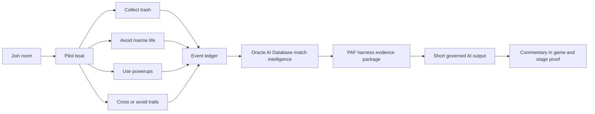

# Advanced GDD: Save the Wildlife AIE Demo Goal

Status: goal specification
Audience: AI engineers, demo builders, presenters, and reviewer agents
Primary demo: Save the Wildlife Oracle AI Database agent demo
Working acronym: AIE = AI Engineer Experience for this document

This is a Game and Goal Design Document. Use it as the execution target for
turning Save the Wildlife into a crisp AIE demo: a playable multiplayer game
that creates real telemetry, stores it in Oracle AI Database, and proves an
engineering-owned agent harness that can produce grounded commentary, replay
captions, recaps, traces, evals, and model-improvement evidence.

If AIE has a different internal expansion in a later program, keep this document
as the product and engineering goal. Rename the label only.

## Goal Prompt For AIE Or Codex

Build the Save the Wildlife AIE demo as a production-shaped, demo-scale game AI
use case. The first screen must be a playable multiplayer 3D ocean cleanup game,
not a marketing page. Players create real match events by joining on mobile or
desktop, moving a boat, collecting trash, avoiding marine life, collecting
powerups, crossing trails, and reaching game over. The system must persist those
events into Oracle AI Database and use them as the only source of truth for AI
commentary and replay outputs.

The demo must prove the pattern "Agent = Model + Harness." The model can phrase
commentary, but the harness owns evidence retrieval, SQL summaries, JSON replay
payloads, graph relationships, vector-ready memory, identity, budgets, traces,
fallbacks, policy, source metadata, and broadcast back into the live game. Use
Oracle Private Agent Factory Canvas as the business-facing agent surface when
configured and proven by response metadata. Do not claim Canvas, Select AI,
in-database agents, replay, vector memory, or two live private LLM routes
produced a specific result unless the current receipt proves it.

Deliver the demo in phases. Start from the current verified live baseline,
preserve public playability, then deepen the AI moments: mechanics-aware live
commentary, replay captions only when clip evidence exists, post-match recap,
clip title, model-route comparison, behavior training export, eval gates, and a
stage console that makes proof easy to inspect. Every new claim needs a receipt,
and every receipt needs a boundary.

## Intent Summary

Save the Wildlife is not a score demo. It is an evidence-first AI engineering
demo where live gameplay becomes governed match intelligence and the AI output
is allowed to speak only from recorded truth.

## Success Standard

The demo is successful when a room can play the game, create events, inspect the
evidence, request commentary, see the result return to the live experience, and
understand why the harness is the real engineering product.

Minimum success:

- Mobile and desktop players reach `RUNNING` and can collect visible items.
- The presenter can start and end a room without joining as a player.
- Game events include coordinates, player identity, score, item evidence,
  powerup state, trail crossings, freezes, and game-over summaries.
- Oracle AI Database stores and exposes SQL, JSON, graph-ready, replay, trace,
  eval, and vector-ready memory objects where configured.
- The PAF context API can show what evidence exists for a session.
- The commentary API returns a short, safe, source-metadata-rich response.
- The browser receives `commentary.ready` and shows the output after game over.
- The current stage brief states what is proven and what remains gated.

Stretch success:

- Replay caption output uses a real replay manifest and refuses to mention clips
  when no replay evidence exists.
- Similar-moment retrieval uses scoped vector-ready memories with provenance.
- Base versus candidate route metadata is visible in the admin AI view.
- A strict upstream canary passes only after both private LLM routes report live
  upstream runtime mode.
- The demo can export accepted behavior traces for fine-tuning without training
  mutable gameplay facts into weights.

## Experience Pillars

1. Play first, architecture second.
   The audience should create the data before seeing the diagram.

2. SQL first, LLM last.
   Recorded events and deterministic summaries decide what happened.

3. The harness is the product.
   The model emits tokens; the harness owns tools, memory, policy, source
   metadata, trace, fallback, and the live-system connection.

4. Canvas shapes, metadata proves.
   Canvas can shape the agent experience, but response metadata proves which
   runtime path produced a specific line.

5. Proof first, claim second.
   Every stage statement must map to a live receipt, source file, or explicit
   caveat.

## Target Audiences

| Audience | What they should feel | What they should learn |
|---|---|---|
| AI engineer | "This is inspectable." | How to design an agent harness around governed data. |
| Developer advocate | "This is memorable." | How to turn infrastructure into a live story. |
| Business user | "I can shape the agent safely." | Canvas config is valuable when connected to a harness. |
| Cloud architect | "This is production-shaped." | OKE, Socket.IO, Coherence, Oracle AI Database, PAF, and model routes are one system. |
| Gaming product owner | "This maps to real workflows." | Commentary, replay captions, recaps, moderation, coaching, and analytics can share one evidence layer. |

## Core Player Fantasy

Players are wildlife rescue pilots in a shared ocean arena. They collect trash,
avoid harming marine life, use powerups, leave trails, and create dramatic match
moments. The point is not only to win. The point is to create a high-signal
event stream that an AI system can explain without inventing.

## Core Loop

## Gameplay Systems

### Lobby And Room Control

Purpose:

- Let players join from phones without needing presenter privileges.
- Let the presenter start and end a room from `/admin` or `?admin=1`.
- Keep the room state authoritative on the server.

Required behavior:

- Player path: name entry, lobby waiting state, roster visibility, no player
  start button.
- Presenter path: room ID, optional admin token, roster, Start Game, End Game,
  copyable player URL, no WebGL auto-start in admin panels.
- Server states: `WAITING`, `STARTING`, `RUNNING`, `ENDED`.
- Clients receive authoritative duration, world size, countdown, game state,
  and timer.

Acceptance:

- A mobile user can join, wait, see roster state, and enter `RUNNING`.
- Presenter can start the match without being counted as a player.
- Admin observability and AI learning routes load styled assets from nested
  paths.

### Ocean Cleanup Movement

Purpose:

- Give the audience an immediately understandable action: steer a boat and
  collect visible objects.
- Create coordinates and time-series movement evidence for AI context.

Required behavior:

- Desktop supports keyboard movement.
- Mobile supports joystick movement with visible, stable touch controls.
- Boat sits at the waterline and reads as moving on water.
- Movement creates position samples and wake/ripple evidence for visual proof.

Acceptance:

- Game smoke reports mobile `RUNNING`, joystick visible, safe opening spawn,
  and boat-waterline contact.
- Desktop movement produces visible wake or motion evidence.

### Items And Scoring

Purpose:

- Turn simple actions into structured telemetry.

Required item types:

- Trash: positive objective and primary pickup event.
- Marine life: avoidance pressure and penalty/risk event.
- Powerups: mechanics-aware variety and commentary hooks.

Current powerup vocabulary:

- `powerup_speed`
- `powerup_shield`
- `powerup_magnet`
- `powerup_freeze`

Required telemetry:

- `trash_collected`
- `marine_hit`
- `powerup_collected`
- item ID, item type, coordinates, score delta, accepted/rejected collision
  evidence, and powerup type where relevant.

Acceptance:

- Client only removes or scores a pickup after authoritative acceptance.
- Visible item scale matches server collision validation closely enough that
  players trust pickups.
- Commentary can mention powerups only when they are present in evidence.

### Trails And Freeze Drama

Purpose:

- Create a distinct multiplayer mechanic that gives graph relationships a
  reason to exist.

Required behavior:

- Player movement leaves trails.
- Crossing another player's trail records relationship evidence.
- Freeze or slow state has duration metadata and visible feedback.

Required telemetry:

- `trail_crossed`
- `player_frozen`
- related player ID
- trail segment metadata
- freeze duration
- coordinates

Acceptance:

- The context path can answer who crossed whose trail and where.
- Commentary mentions trail crossings or freezes only when these event counts
  are greater than zero.

### Bots

Purpose:

- Keep the room lively for stage use when audience participation is low.
- Generate enough telemetry for proof without blocking human gameplay.

Required behavior:

- Bots can be data-only for production smoke or visible in local/demo modes
  when explicitly needed.
- Bots do not create large visual blockers in public gameplay.
- Bot route and render mode are exposed in diagnostics.

Acceptance:

- The game remains playable with low human turnout.
- Telemetry can still be produced from seeded or bot-assisted sessions.
- Human path stays clear on mobile.

### Replay Moments

Purpose:

- Show that replay AI should be event-aligned rather than raw-video magical.

Required behavior:

- Browser records a bounded JSON replay ring around key events.
- Replay service stores clip manifests with session, player, event type,
  timecode, and JSON payload or production media pointer.
- Replay output formats use clip evidence only when present.

Acceptance:

- Replay caption refuses clip-specific claims when replay count is zero.
- When a clip exists, the caption references only recorded event/timecode
  evidence.

## AI Use Case Design

### Primary Use Case

Live Match Intelligence for Gaming:

The game emits operational telemetry. Oracle AI Database stores it as governed
truth. The harness retrieves scoped evidence and lets AI phrase short outputs
for commentary, replay captions, clip titles, recaps, and developer-facing
analysis.

### Why It Matters

Game studios and interactive product teams need AI features that are creative
without becoming unbounded. This demo shows how to design AI around event truth:

- Live commentator line after a match.
- Replay caption for a proven clip.
- Post-match recap for a player or room.
- Similar-moment retrieval when memory exists.
- Graph explanation for player relationships.
- Model route evaluation and behavior-training capture.
- Human/business shaping through Canvas without bypassing evidence.

### AI Output Formats

| Format | Trigger | Evidence required | Output rule |
|---|---|---|---|
| `live_line` | `game_over` or presenter call | SQL summary at minimum | Under 200 characters, mechanics-aware, no invented facts. |
| `replay_caption` | Replay proof or presenter call | Replay clip manifest | Mention clips/timecodes only when present. |
| `post_match_recap` | End of match | SQL summary plus optional JSON/graph/vector context | Slightly fuller recap, still evidence-bound. |
| `clip_title` | Replay clip selection | Clip manifest and event type | Short title using recorded event facts. |

### AI Style Contract

The AI voice should be stage-safe, concise, and game-native:

- Mention players, score, trash, powerups, trail crossings, freezes,
  coordinates, prior best, or replay only when present.
- Avoid database jargon in player-facing commentary unless the presenter asks
  for proof.
- Avoid claiming the model watched raw footage.
- Avoid hidden chain-of-thought or internal reasoning.
- Keep profanity and unsafe language out.
- Return source metadata with every AI response.

Good live line:

> Ada finished with 42 after shield help, one trail crossing, and a freeze near x=4.5 z=-9.3.

Bad live line:

> The LLM watched Ada's epic replay and predicted a championship run.

The bad line invents raw viewing and prediction. It is not allowed.

## Data And Evidence Contract

### Required Event Types

- `game_started`
- `position_sample`
- `trash_collected`
- `marine_hit`
- `powerup_collected`
- `trail_crossed`
- `player_frozen`
- `game_over`

### Required Event Fields

At minimum, each persisted gameplay event should preserve:

- session ID
- room ID
- player ID
- player name when available
- event type
- event timestamp
- score or score delta when relevant
- x/z coordinates when relevant
- related player ID when relevant
- item ID and item type when relevant
- metadata JSON for mechanic-specific details

### Oracle AI Database Objects

The demo should treat these as the match-intelligence foundation:

- `STWL_GAME_EVENTS`: authoritative SQL event ledger.
- `STWL_EVENT_DOCUMENTS`: JSON event documents.
- `STWL_GRAPH_VERTICES` and `STWL_GRAPH_EDGES`: graph-ready relationships.
- `STWL_REPLAY_CLIPS`: replay clip manifests.
- `STWL_AGENT_MEMORIES`: vector-ready similar-moment memory.
- trace and eval tables used by the PAF/model AI proof path.

### Evidence Quality Rules

- No generated output may mention an event absent from the evidence package.
- Replay-specific text requires replay evidence.
- Similar prior moments require memory evidence.
- Canvas-specific claims require response metadata proving the Canvas path.
- In-database-agent claims require response metadata proving that path.
- Two-live-model claims require strict upstream readiness, not adapter mode.

## Harness Architecture Goal

The harness is the deployed private-agent-factory endpoint. It should:

- Receive a session/player/output-format request.
- Load SQL summary first.
- Add JSON event documents.
- Add graph facts when available.
- Add replay clips when available.
- Add vector-ready memories when available.
- Attempt configured Oracle AI Database paths such as Select AI or in-database
  agents where appropriate.
- Route a bounded evidence package through Canvas or model adapters when
  selected and proven.
- Enforce length, safety, and evidence constraints.
- Persist traces and eval metadata.
- Return output text plus metadata.
- Broadcast `commentary.ready` back into the game when triggered by gameplay.

## Stage Demo Flow

### 0:00 To 2:30 - Play

Presenter asks the room to open the game on phones. Players create data through
movement, pickups, powerups, trails, freezes, and collisions.

Target belief:

> This is a real multiplayer 3D app, not a slide-only AI demo.

### 2:30 To 4:00 - Reveal Telemetry

Presenter shows that actions became rows and event documents.

Target belief:

> The AI story starts from events, not prompts.

### 4:00 To 7:30 - Match Intelligence

Presenter calls context and commentary APIs.

Target belief:

> Oracle AI Database is the evidence layer: SQL, JSON, graph, replay, vector,
> traces, evals, and deterministic fallback.

### 7:30 To 12:00 - Harness

Presenter shows architecture and source metadata.

Target belief:

> The agent is model plus harness. The harness is what makes it production-shaped.

### 12:00 To 16:30 - Model AI And Learning

Presenter shows adapter proof, route metadata, behavior training export, and
strict upstream gate.

Target belief:

> Behavior can be trained, but mutable game facts stay in Oracle AI Database.

### 16:30 To 18:00 - Close

Presenter sends audience to notebooks or follow-up build path.

Target belief:

> Start with real events. Store them where governance lives. Retrieve context
> deliberately. Let the model phrase, not fabricate.

## Build Milestones

### M0 - Preserve The Verified Baseline

Goal:

- Keep the current public game, PAF health, context, commentary, stage brief,
  and model proof receipts valid.

Surfaces:

- `web`
- `server`
- `score`
- `replay`
- `private-agent-factory`
- `deploy`
- `scripts`
- `event-pack`

Acceptance:

- `npm run check:conference-demo:stage` produces a usable stage brief.
- Game and transport smokes stay `ready` or have documented caveats.
- No new claim exceeds current proof.

### M1 - Stage-Perfect Play Loop

Goal:

- Make the first 2 minutes reliable and satisfying on phones.

Must include:

- Clean player join path.
- Presenter-only start.
- Visible joystick.
- Clear trash/powerup scale.
- No bot blockers.
- Stable waterline and item counts.
- End-game transition with results and commentary area.

Acceptance:

- `npm run check:conference-demo:game` passes.
- Manual mobile proof is available if browser automation is blocked.

### M2 - Evidence-Rich Gameplay

Goal:

- Ensure every interesting mechanic produces agent-ready evidence.

Must include:

- Accepted pickup evidence.
- Powerup metadata.
- Trail crossing and freeze relationships.
- Replay capture around key events.
- Game-over summary.
- Traceable player/session IDs.

Acceptance:

- `server/test/gameEvents.test.js` covers event normalization and summaries.
- `/paf/api/context` shows event counts and capabilities for a seeded session.
- Replay and vector counts are shown honestly, including zero.

### M3 - Grounded Agent Moment

Goal:

- Make commentary visibly tied to what happened in the match.

Must include:

- `live_line`.
- `replay_caption`.
- `post_match_recap`.
- `clip_title`.
- Source metadata.
- Fallback metadata.
- Trace persistence.

Acceptance:

- `/paf/api/commentary` returns `warning: null` for healthy seeded calls.
- Output stays within length and safety bounds.
- Unsupported mechanics are not mentioned.
- Browser receives and displays `commentary.ready`.

### M4 - Canvas And Business Shaping

Goal:

- Show how Canvas can shape the agent surface while the harness protects truth.

Must include:

- PAF health showing Canvas configured.
- Canvas path represented in architecture.
- Response metadata proving when Canvas was used.
- Stage language that distinguishes "configured" from "produced this line."

Acceptance:

- Claim ledger includes Canvas proof and boundary.
- Presenter can answer "Did Canvas generate that?" with metadata.

### M5 - Model AI And Continual Learning Proof

Goal:

- Show model improvement as an engineering pipeline, not a vague tuning claim.

Must include:

- Base and candidate route metadata.
- Tier-1000 adapter canary proof.
- Behavior trace export.
- Trainer dry-run or training job path.
- Strict upstream gate.
- Promotion held until both private live LLM routes are proven.

Acceptance:

- `npm run check:model-ai-demo:proof` writes the proof bundle.
- Adapter proof is separated from strict upstream proof.
- No stage copy claims two live private LLMs until strict proof passes.

### M6 - Production Gaming Template

Goal:

- Make the demo reusable as a gaming industry pattern.

Must include:

- Architecture diagram.
- Data model.
- Event taxonomy.
- AI output contract.
- Operator runbook.
- Failure pivots.
- Notebook CTAs.
- Clear claim boundaries.

Acceptance:

- Event pack can support a live talk, a recorded demo, and a technical Q&A.
- Source map connects claims to files, endpoints, or receipts.

## Acceptance Test Matrix

| Area | Command or proof | Pass signal |
|---|---|---|
| Public stage brief | `npm run check:conference-demo:stage` | Stage verdict and generated receipt exist. |
| Game visual proof | `npm run check:conference-demo:game` | Mobile and desktop reach `RUNNING` with healthy item counts. |
| Transport proof | `npm run check:conference-demo:transport` | Public HTTP and Socket.IO room lifecycle pass. |
| AI preflight | `npm run check:conference-demo` | PAF health, context, commentary, and model proof checked with caveats. |
| Model AI proof | `npm run check:model-ai-demo:proof` | Adapter proof ready and strict blocker explicit when upstream is not live. |
| Web unit tests | `npm --prefix web run test:unit` | Browser behavior tests pass. |
| Server unit tests | `npm --prefix server run test:unit` | Event and realtime tests pass. |
| Web build | `npm --prefix web run build` | Production bundle builds, allowing known size warnings. |
| Product naming | Review stage materials for legacy version-first Oracle database labels | Use Oracle AI Database for the product and Oracle Autonomous Database only for the cloud service. |
| Claim safety | Review [claim-ledger.md](claim-ledger.md) and the generated stage brief | No Canvas, replay, vector, or two-live-model claim exceeds current receipt metadata. |

## Must-Have Backlog

- Keep mobile-first gameplay reliable.
- Keep presenter admin separate from player join.
- Preserve authoritative server room state.
- Preserve Oracle AI Database as the evidence source of truth.
- Preserve PAF/harness source metadata on every AI output.
- Preserve deterministic fallback.
- Keep replay claims evidence-gated.
- Keep model-route claims gated by strict proof.
- Keep event-pack docs aligned with generated receipts.

## Should-Have Backlog

- Add a compact in-game "AI is ready" status after game over.
- Add a presenter-safe seeded session picker for known proof sessions.
- Add replay clip browser in admin AI learning panel.
- Add a match intelligence inspector that shows SQL, JSON, graph, replay, and
  memory tabs for one session.
- Add route comparison cards for base versus candidate behavior output.
- Add export controls for accepted traces with redaction status.

## Could-Have Backlog

- Team mode with team-level recap.
- Weather or hazard events that create richer commentary hooks.
- Spectator mode for stage display.
- Achievement or coaching output using the same evidence layer.
- Moderation or safety incident recap as a second gaming use case.

## Non-Goals

- Do not build a generic landing page as the primary experience.
- Do not make AI commentary depend on unbounded prompt text.
- Do not claim the model watched raw video.
- Do not train mutable gameplay facts into weights.
- Do not hide fallbacks or caveats.
- Do not make Canvas a detached manual side path.
- Do not change runtime infrastructure just to make the story cleaner.

## Risk Register

| Risk | Impact | Mitigation |
|---|---|---|
| Venue Wi-Fi is weak | Few live player events | Use seeded smoke session and bot-assisted data. |
| Browser automation blocked | No fresh visual receipt | Use manual visual proof checklist and state it clearly. |
| Canvas path slow or unavailable | Canvas-specific claim unsafe | Use metadata and fallback language; prove configured, not produced. |
| Replay/vector evidence count is zero | Replay/vector claim unsafe | Display zero honestly and avoid clip or similar-memory phrasing. |
| Public bundle stale | Stage screenshots contradict source | Use stage brief, image tags, and deployment receipt as authority. |
| Model upstream not attached | Two-live-model claim unsafe | Keep strict gate red and frame it as engineering honesty. |
| Bot visuals block play | Human gameplay suffers | Use data-only bots publicly; visible bots only when explicitly enabled. |

## Claim Boundaries

Safe:

- The game is live when transport and visual receipts prove it.
- Oracle AI Database is the evidence layer for gameplay events, JSON, graph,
  replay metadata, vector-ready memory, traces, evals, and training examples
  when those objects are configured.
- The harness connects gameplay evidence to PAF, Canvas, Select AI,
  in-database agents, model adapters, fallback, trace, and live broadcast.
- Adapter mode proves the model route handoff and behavior pipeline.

Gated:

- Canvas produced this exact line.
- The in-database agent produced this exact line.
- Replay caption used a real clip.
- Vector memory found a similar prior moment.
- Two live private LLM runtimes are serving base and candidate output.
- Fine-tuned model is promotion-ready.

Never say:

- "The LLM watched the game."
- "The model watched raw replay footage."
- "Canvas replaced the harness."
- "One big prompt is the architecture."
- "The fine-tuned model is live" unless strict upstream proof passes.

## Definition Of Done

The AIE demo is done when:

- A first-time audience can play within 30 seconds of scanning or opening the
  game URL.
- The presenter can start the match, show events, request context, request
  commentary, and explain metadata without leaving the prepared flow.
- A technical reviewer can trace every claim from slide to receipt to source.
- The game remains fun enough that the audience remembers the mechanic, not
  only the product names.
- The AI behavior is useful, short, grounded, and inspectable.
- The strict model claims are either proven or explicitly held.

## Reference Files

- [README.md](README.md)
- [architecture.md](architecture.md)
- [demo-runbook.md](demo-runbook.md)
- [ai-engineer-demo-master-card.md](ai-engineer-demo-master-card.md)
- [claim-ledger.md](claim-ledger.md)
- [source-map.md](source-map.md)
- [current-proof-snapshot.md](current-proof-snapshot.md)
- [continual-learning-operating-model.md](continual-learning-operating-model.md)
- [bot-data-and-ollama-training-runbook.md](bot-data-and-ollama-training-runbook.md)
- [notebook-cta-map.md](notebook-cta-map.md)
