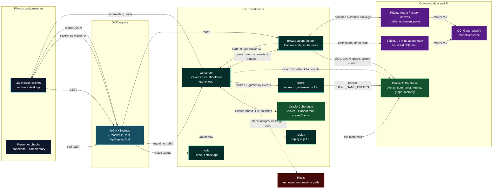
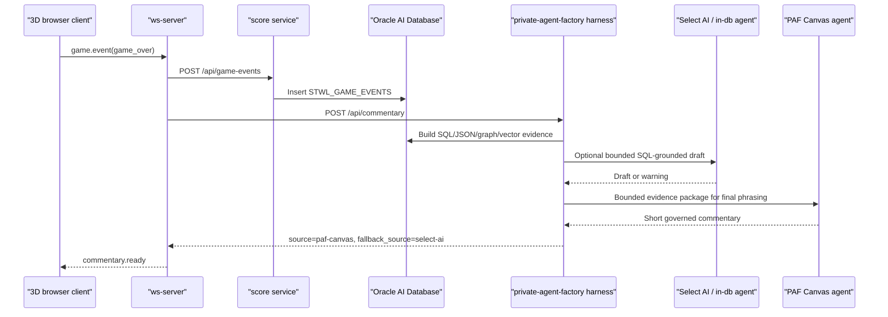

# Current Architecture After Redis Removal

This is the current Save the Wildlife demo architecture after removing Redis
from the real-time stack. Socket.IO clustering now uses Oracle Coherence as the
fanout bus for multi-pod `ws-server` deployments; local and single-pod
development can still use the in-memory backend.

The important demo message stays the same: Canvas lets business users shape the
agent experience, while the endpoint harness keeps it connected to governed
data, deterministic tools, live gameplay, and production controls.

## Runtime Topology

## Game-Over Commentary Sequence

## Post-Redis Rules

- `REALTIME_CLUSTER_BACKEND=coherence` is the production multi-replica path.
- `REALTIME_CLUSTER_BACKEND=memory` is acceptable for local or single-pod use.
- `REALTIME_CLUSTER_BACKEND=redis` is intentionally invalid and covered by a
  regression test.
- Coherence fanout entries are TTL-bounded and payload-capped through
  `COHERENCE_SOCKET_BUS_TTL_MS` and
  `COHERENCE_SOCKET_EVENT_MAX_PAYLOAD_BYTES`.
- The Canvas connection remains inside the `private-agent-factory` harness; it
  is not a detached manual side path.
