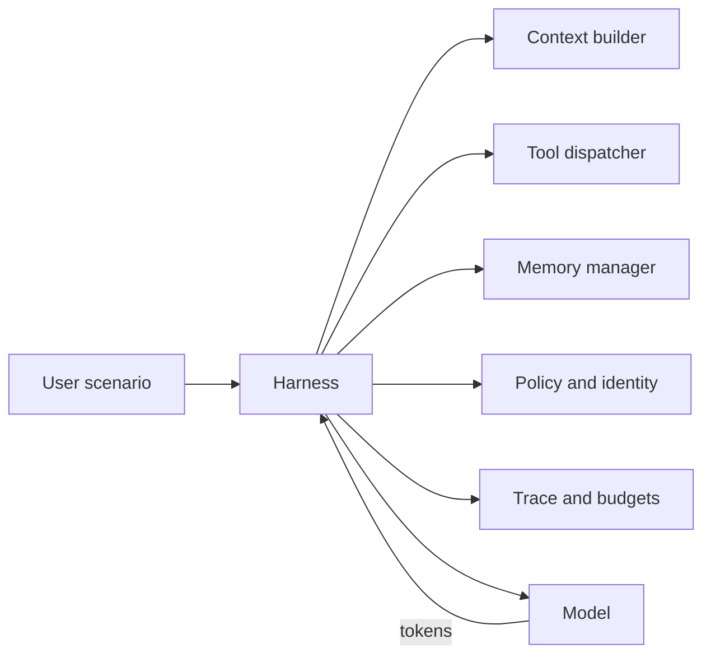

# Deck Brief

## Purpose

Create a concise 10-slide technical story for AI developers that uses the Save the Wildlife game as a live, memorable entry point into Oracle AI Database match intelligence: commentary, replay captions, memory, and production-safe agent architecture.

The message to land: sometimes AI engineers should let business users assemble the agent experience in Oracle Private Agent Factory Canvas, then attach an engineering-owned harness that keeps the agent connected to governed data, deterministic tools, live systems, and production controls. In this demo, the business-facing Canvas agent handles final phrasing while the harness connects it to the live 3D game, Oracle AI Database SQL evidence, Select AI or in-database agent drafts, replay context, and commentary broadcast.

## Design System

- 16:9.
- Ivory or charcoal backgrounds.
- Teal as primary system color.
- Sky for AI/data movement.
- Pine for governance and production controls.
- Oracle Red only for the final CTA or one critical emphasis.
- Sparse copy, strong diagrams, no generic AI decoration.

## Slide Inventory

1. Play First. Architecture Second.
2. A Game That Emits Agent-Ready Events.
3. The Model Does Not Watch Raw Footage.
4. Runtime Path: Evidence First, Model Last.
5. Live Proof: Commentary From The Timeline.
6. Canvas Agent, Production Harness.
7. Agent = Model + Harness.
8. The Game Pattern Becomes An Enterprise Pattern.
9. Notebooks: The Developer Path.
10. CTA: Build Agents Around Truth.

## Required Proof Objects

- Game URL / QR.
- Event timeline.
- `STWL_GAME_EVENTS` simplified schema.
- `/paf/api/context` evidence excerpt.
- Replay clip manifest example.
- Runtime architecture diagram.
- Commentary API response excerpt.
- PAF health excerpt.
- Agent harness formula.
- Notebook CTA cards.

## Suggested Visuals

### Runtime Architecture

```mermaid
flowchart LR
  A["Mobile players"] -->|"powerups, trails, freezes, coords"| B["Game / Socket.IO"]
  B -->|"event stream + replay JSON"| C["Oracle AI Database"]
  C -->|"SQL, JSON, graph, vector context"| D["/paf/api/context"]
  D -->|"bounded evidence"| E["Select AI / in-db agents"]
  E -->|"bounded draft + evidence"| F["Oracle Private Agent Factory Canvas"]
  F -->|"live line, replay caption, recap"| G["Match intelligence outputs"]
```

### Harness Architecture

## Footer Language

Use:

`Oracle AI Database | Save the Wildlife agent demo`

Core spoken phrase:

`Canvas lets the business shape the agent. The harness keeps it connected, governed, and live.`

Avoid:

- Product-version-first naming.
- "LLM watched the game."
- "LLM watched the raw replay footage."
- "Autonomous LLM generated the commentary from scratch."
- "Canvas replaced the engineering work."

## Speaker Note Density

Keep slides sparse; put fuller text in notes. The user should speak the story, not read the slide.
