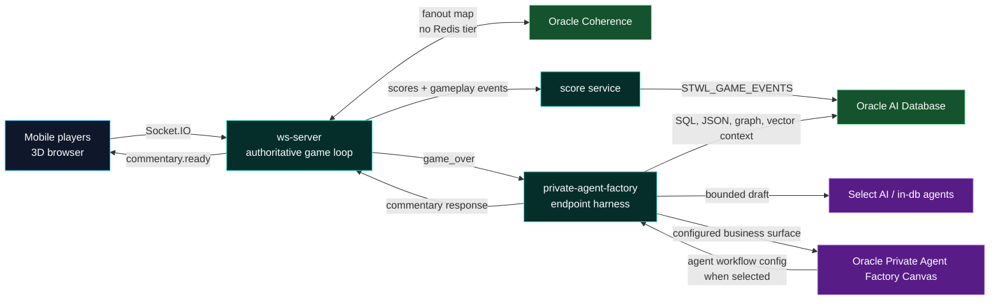
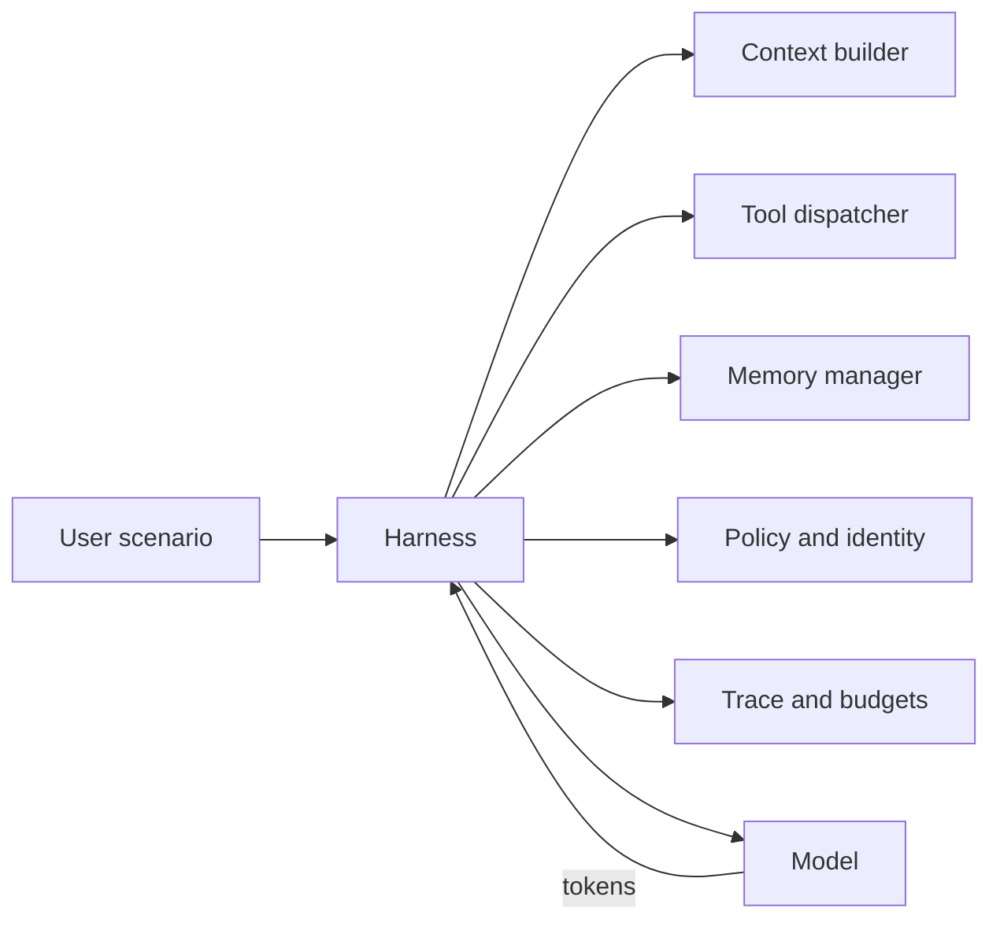

# Deck Brief

## Purpose

Create a concise 10-slide technical story for AI developers that uses the Save the Wildlife game as a live, memorable entry point into Oracle AI Database match intelligence: commentary, replay captions when evidence exists, memory, and production-safe agent architecture.

The message to land: sometimes AI engineers should let business users shape the agent experience in Oracle Private Agent Factory Canvas, then attach an engineering-owned harness that keeps the agent connected to governed data, deterministic tools, live systems, and production controls. In this demo, PAF and Canvas are configured as the business-facing agent surface; the harness connects the live 3D game to Oracle AI Database SQL evidence, Select AI or in-database agent drafts, model-router adapters, replay context when present, deterministic fallback, and commentary broadcast. The response metadata remains the authority for which path produced a specific line.

## Current Verified Receipts

- Public game endpoint: `http://130.162.174.167/`
- Deployed proof: commit `e7d4543`, deployment `prod-conference-demo-e7d4543`
- Generated live receipt: `.codex_tmp/conference-stage-brief/latest.md` from `npm run check:conference-demo:stage`
- Public game smoke: use `.codex_tmp/conference-stage-brief/latest.md` as the authority
- Public transport smoke: use `.codex_tmp/conference-stage-brief/latest.md` as the authority
- Mobile proof: `RUNNING`, joystick visible, safe nearest-trash buffer, boat seated at waterline when game smoke or manual visual proof is current
- Public conference preflight: `ready_with_caveats`
- PAF health: Oracle, GenAI, Canvas, Select AI, in-db agent, graph/replay/vector retrieval, and model router configured
- Current claim boundary: smoke replay/vector rows may be empty; the exact smoke commentary line can report `canvas:null`, `in_db_agent:null`, and behavior-adapter runtime

## Design System

- 16:9.
- Ivory or charcoal backgrounds.
- Teal as primary system color.
- Sky for AI/data movement.
- Pine for governance and production controls.
- Oracle Red only for the final CTA or one critical emphasis.
- Sparse copy, strong diagrams, no generic AI decoration.

## Slide Inventory

1. Play First. Architecture Second.
2. A Game That Emits Agent-Ready Events.
3. The Model Does Not Watch Raw Footage.
4. Runtime Path: Evidence First, Model Last.
5. Live Proof: Commentary From The Timeline.
6. Canvas Shapes, Harness Proves.
7. Agent = Model + Harness.
8. The Game Pattern Becomes An Enterprise Pattern.
9. Notebooks: The Developer Path.
10. CTA: Build Agents Around Truth.

## Required Proof Objects

- Game URL / QR from [stage-entry.html](stage-entry.html) and `assets/game-url-qr.svg`.
- Event timeline.
- `STWL_GAME_EVENTS` simplified schema.
- `/paf/api/context` evidence excerpt.
- Replay clip manifest example.
- Runtime architecture diagram.
- Post-Redis Coherence fanout diagram.
- Commentary API response excerpt.
- PAF health excerpt.
- Public smoke receipt excerpt: mobile `RUNNING`, joystick visible, safe opening spawn.
- Conference preflight receipt excerpt: `ready_with_caveats` with explicit claim boundaries.
- Agent harness formula.
- Notebook CTA cards.

## Suggested Visuals

### Runtime Architecture

Use [architecture.md](architecture.md) for the full topology and game-over
commentary sequence.

### Harness Architecture

## Footer Language

Use:

`Oracle AI Database | Save the Wildlife agent demo`

Core spoken phrase:

`Canvas lets the business shape the agent. Metadata proves the path. The harness keeps it connected, governed, and live.`

Avoid:

- Product-version-first naming.
- "LLM watched the game."
- "LLM watched the raw replay footage."
- "Autonomous LLM generated the commentary from scratch."
- "Canvas replaced the engineering work."
- "Canvas produced this exact line" unless response metadata proves it.

## Speaker Note Density

Keep slides sparse; put fuller text in notes. The user should speak the story, not read the slide.
