# GitHub Fork

## Introduction

The source code of the microservice application lives on GitHub. This is a more complex scenario, the easy way would be to have the code as well on OCI DevOps, but this extra integration can be interesting for those of you that still have the code on other source code control systems.

Estimated Time: 15 minutes

Watch the video below for a quick walk-through of this lab.

[DevOps Multiplayer Lab 1](videohub:1_blkwoeqo)

### Objectives

During this lab, you are going to clone a GitHub repository to have your own copy. The rest of the workshop will be working based on your fork.

### Prerequisites

- Oracle Cloud Account.
- Be an OCI administrator in your account (in Free Tier, you are an administrator by default).
- GitHub Account
- Finish the previous Lab.

## Task 1: Fork repo

1. Open a new tab in your browser and go to the [OCI DevOps OKE](https://github.com/oracle-devrel/save-the-wildlife.git) repository.

  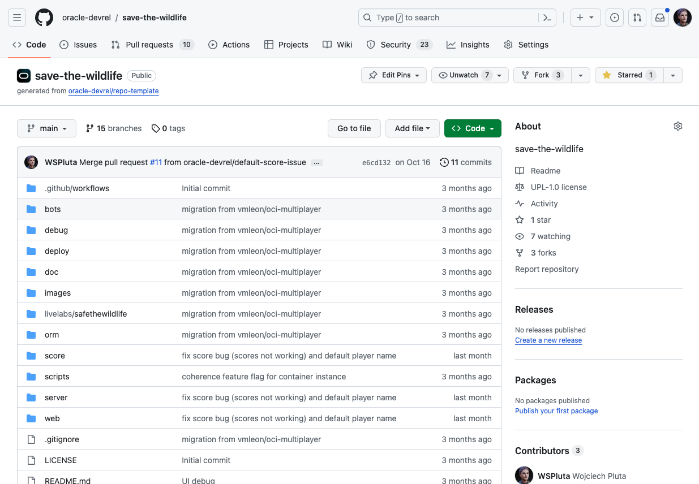

2. Click on **Fork**.

  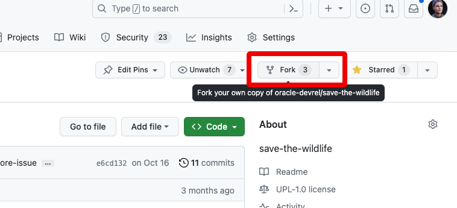

3. Leave the repo name and click **Create fork**, it takes just a few seconds.

  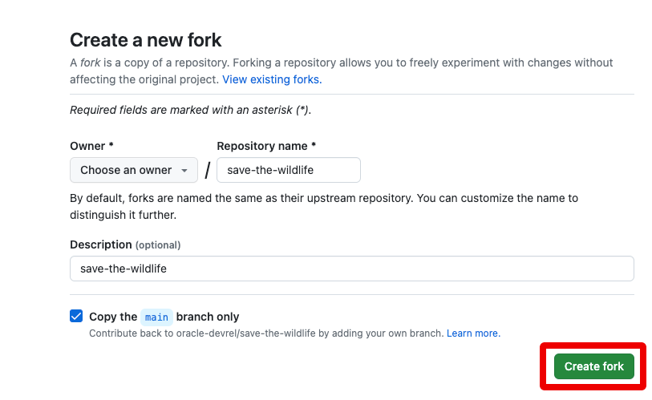


4. When the fork process has finished take a look to the URL. Now the repo is under your GitHub user.

  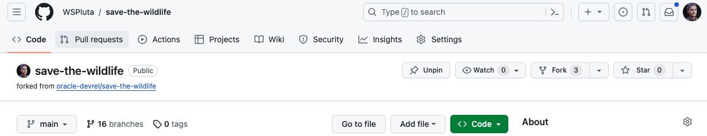


## Task 2: Create an access token

1. Go to your profile icon in GitHub.

  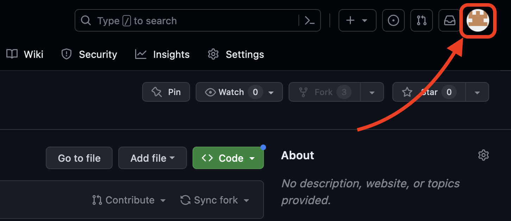

2. Go to **Settings**.

  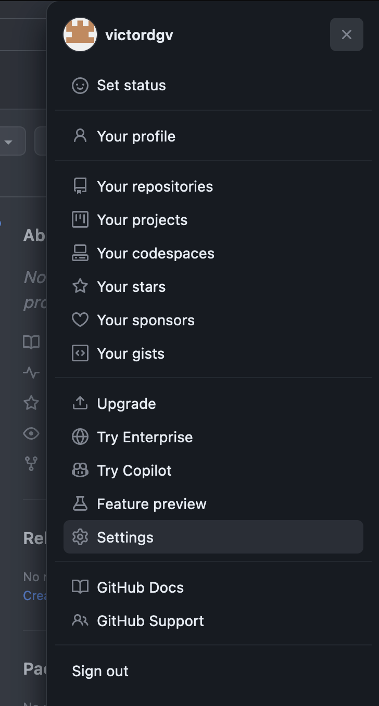

3. Scroll to the end, and click **Developer settings**.

  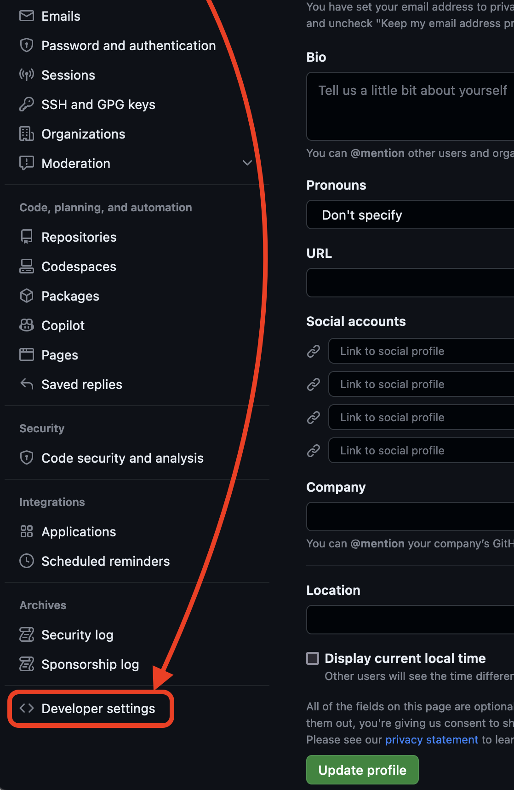

4. Expand **Personal access tokens** and click on **Fine-grained tokens**.

  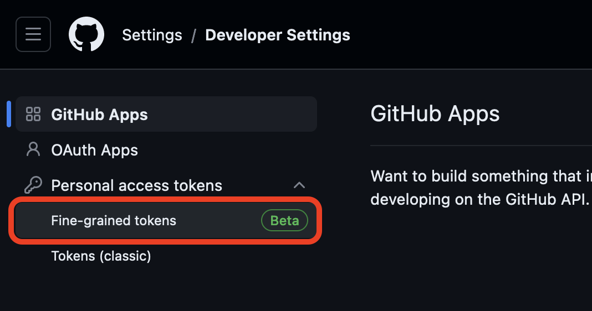

5. Click **Generate new token**.

  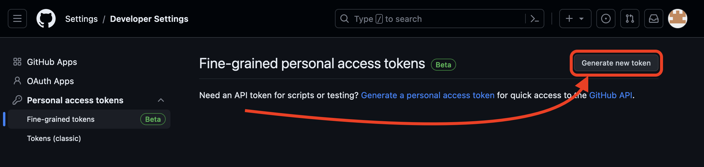

6. Fill in the form: **Token name**, **Expiration**, **Description**, **Resource owner**

  For the name and description you can use any name, we suggest:

    ```
    <copy>save-the-wildlife-token</copy>
    ```
  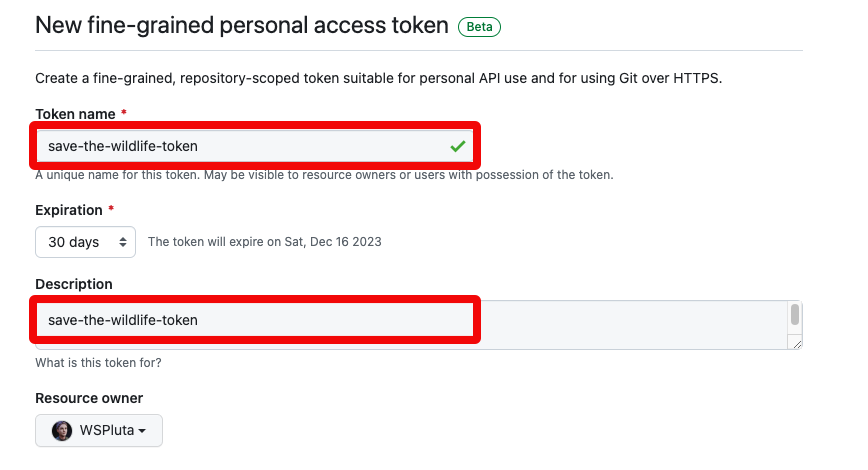

7. Check **Only select repositories**. And select the repository `save-the-wildlife`.

  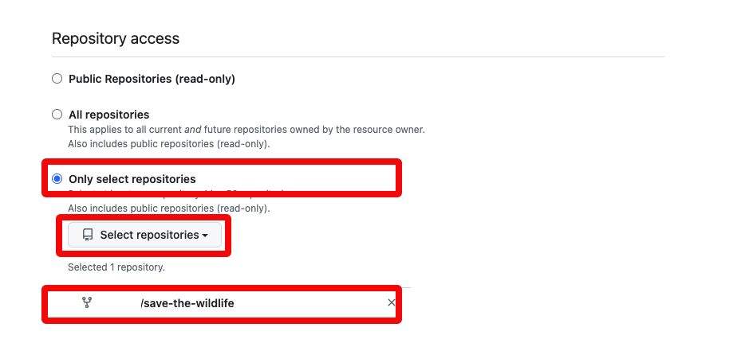

8.  On permissions, set **Contents** to **Read-only**. under **Repository permissions**.

  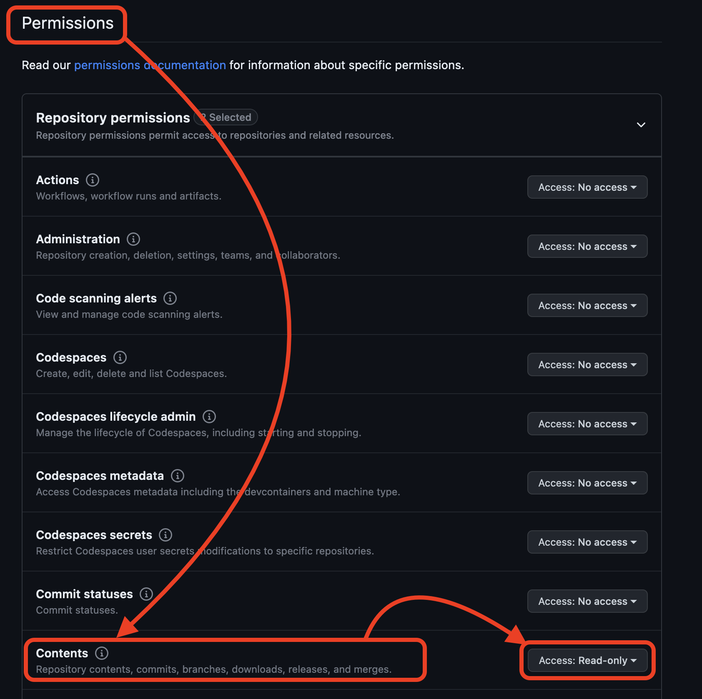

9.  Click **Generate token**.

  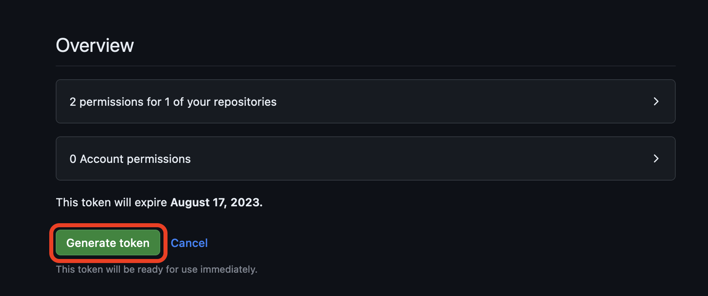

10.  It will ask for your GitHub Account password to confirm.

  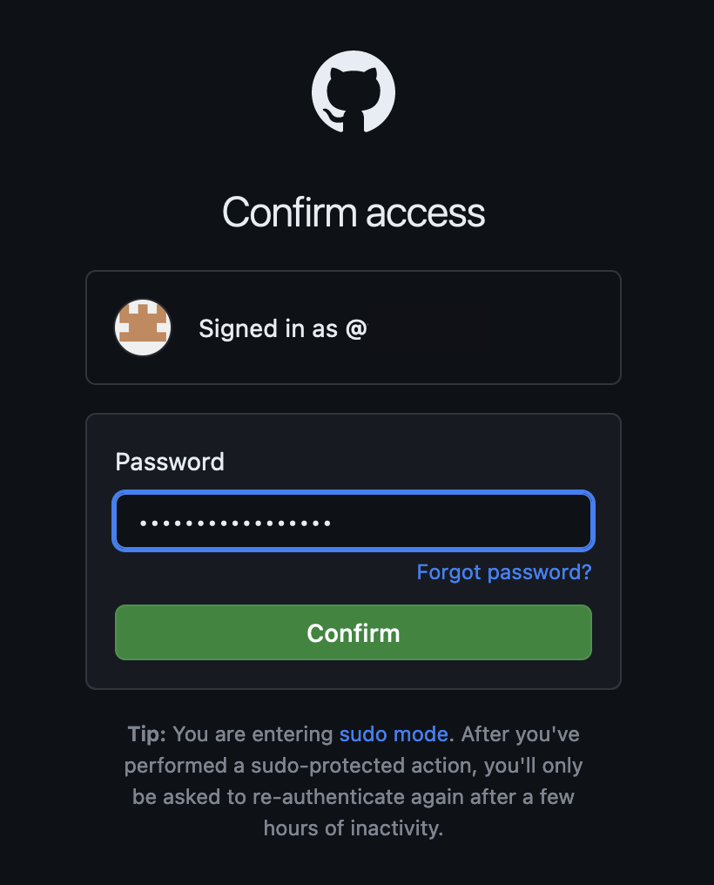


Continual Learning for AI Agents

Positioning

Continual Learning for AI Agents is a practical course for AI developers who want to build agents that improve over time. The course is organized around a simple loop: an agent runs, leaves traces, and those traces are used to improve future behavior.

Learners will see how this improvement can happen at different levels from memory and skill formation to more advanced retrieval optimization and model tuning.

Core Idea: where should an agent learn?

The spine of the course is a single decision frame. When an agent fails on a task, you can adapt it in one of a few distinct places, and each place has a different cost and a different consequence:

Token Space (the prompt and context): inject the right facts and skills so the agent answers correctly now, without touching the model. The cheapest fix.

Structure Space (the embedding and retrieval index): reshape how memories are retrieved so the right ones surface at query time.

Weight Space (the model parameters): when context is not enough, bake the knowledge into the weights via QLoRa and efficient fine-tuning. The most expensive fix.

One running example, end to end

Every module pulls from the same canonical scenario: a supply-chain agent and its memory. The agent has handled shipments, supplier issues and delivery exceptions, and that history becomes the corpus learners inspect, classify, retrieve over and adapt. Using one domain throughout keeps the cognitive load on the concept being taught, not on a new story each lesson.

Course overview: the four modules

Module

Purpose

What they build

Lead

1 Foundations

Set the scene: what an agent is and how continual learning can improve it

Course introduction & theory. Seed a supply-chain memory corpus, classify each memory and project it onto the three layers

Casius

2 Token space

Turn the agent's own traces into reusable skills

Mine interaction traces into reusable skills and usage-driven query templates, then measure the lift.

Casius

3 Structure space

Improve how memory is organized and retrieved so agents can keep autonomously updating their knowledge

Adapting the memory structure using graph traversal to improve memory retrieval

Nacho

4 Model space

Fine-tuning the embedding model, then the model weights

Adapt the model's weights efficiently and using techniques such as QLoRa

Nacho


Module 1 Overview

Here is a quick overview of the chapters in module 1

What is an autonomous agent?


What an agent remembers. The four memory forms (working, episodic, semantic, procedural)


How the agent loop leaves traces that we can use to improve behavior.


Four ways to improve an agent. (Token Space, Structure Space, Model Space)


 A light notebook to consolidate learning and setup context for the following modules.


11.  Copy the generated token in a safe place. You will need it later. Make sure to copy your personal access token now as you will not be able to see this again.

  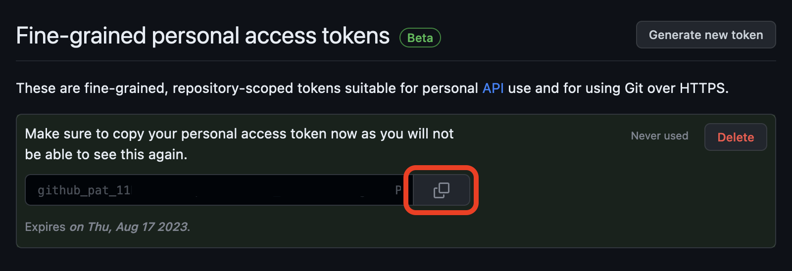

## Task 3: Clone the new repository

1. Go back to the repository by clicking the GitHub menu and the name of the repository.

  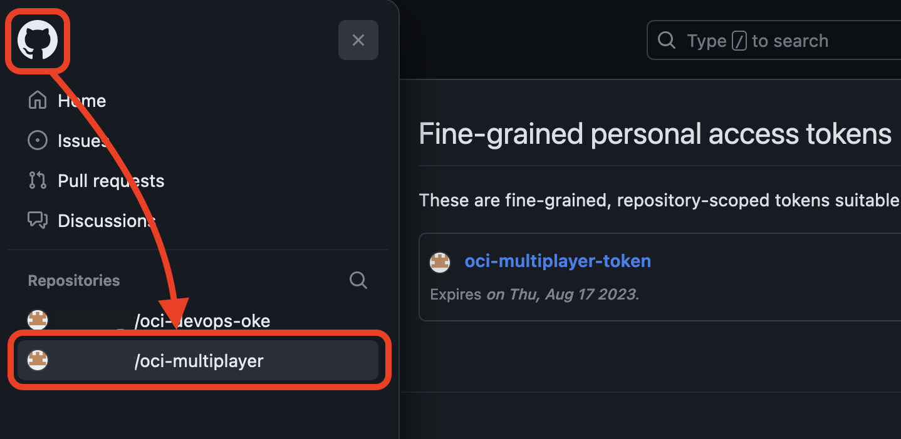

2. Clone the forked repository. Click Code and select HTTPS.

  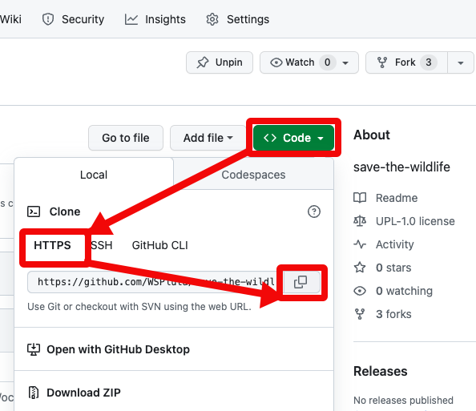

2. Log in on Oracle Cloud and open Cloud Shell.

  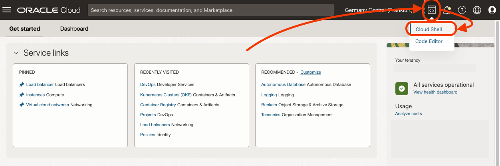

3. Git Clone the repository. Type `git clone ` and then paste the URL copied from GitHub.

    ```bash
    <copy>git clone YOUR_FORK_URL</copy>
    ```

  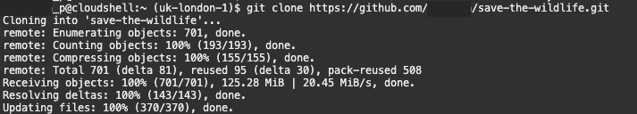

1. Change the directory to the cloned repository.

    ```bash
    <copy>cd save-the-wildlife</copy>
    ```

You may now [proceed to the next lab](#next).

## Acknowledgements

* **Author** - Victor Martin, Tech Product Strategy Director (EMEA)
* **Contributors** - Wojciech Pluta - DevRel, Eli Schilling - DevRel
* **Last Updated By/Date** - July 1st, 2023